# 🏗️ Arquitetura do Project-geotiff

## 📋 Índice
- [Visão Geral](#visão-geral)
- [Fluxo de Processamento](#fluxo-de-processamento)
- [Componentes Principais](#componentes-principais)
- [Diagramas](#diagramas)

---

## 🎯 Visão Geral

O **Project-geotiff** é um servidor REST em TypeScript/Node.js especializado em processar e servir tiles de imagens GeoTIFF multiespectrais (drones/satélites) com capacidades avançadas de:

- ✅ **Leitura de GeoTIFF**: Suporte a imagens com múltiplas bandas espectrais
- ✅ **Geração de Tiles XYZ**: Sistema de tiles compatível com Leaflet/OpenLayers
- ✅ **Índices Espectrais**: Cálculo dinâmico (NDVI, NDWI, EVI, etc.)
- ✅ **Parser de Equações**: Interpretador matemático para equações customizadas
- ✅ **Color Maps**: 12 paletas de cores para visualização
- ✅ **Reprojeção**: Conversão automática entre sistemas de coordenadas

---

## 🔄 Fluxo de Processamento

### Diagrama de Sequência - Requisição de Tile

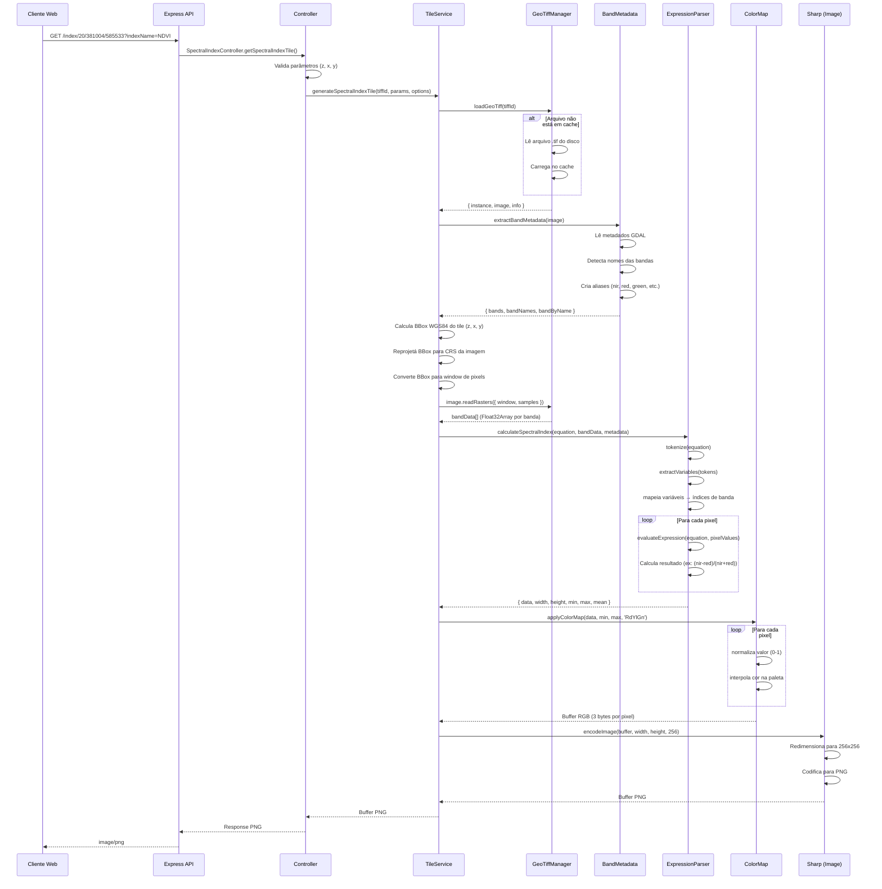

---

## 🧩 Componentes Principais

### 1️⃣ **GeoTiffManager** (Singleton)
```typescript
// Responsável por: cache de arquivos, carregamento, limpeza automática
```

**Funcionalidades:**
- Cache em memória de arquivos GeoTIFF
- Carregamento lazy (só carrega quando necessário)
- Limpeza automática baseada em tempo (CACHE_AGE_MINUTES)
- Resolução de caminhos (absolutos ou relativos ao DATA_DIR)

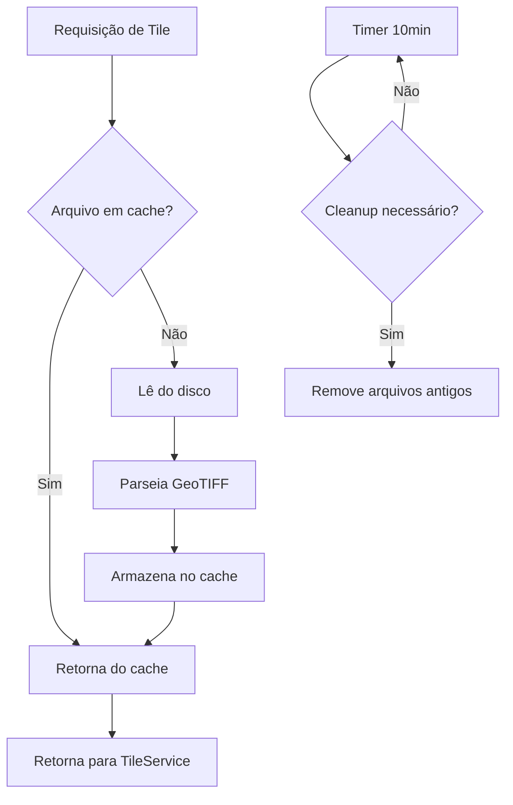

---

### 2️⃣ **BandMetadata**
```typescript
// Responsável por: extrair e interpretar metadados das bandas
```

**Estratégias de detecção:**

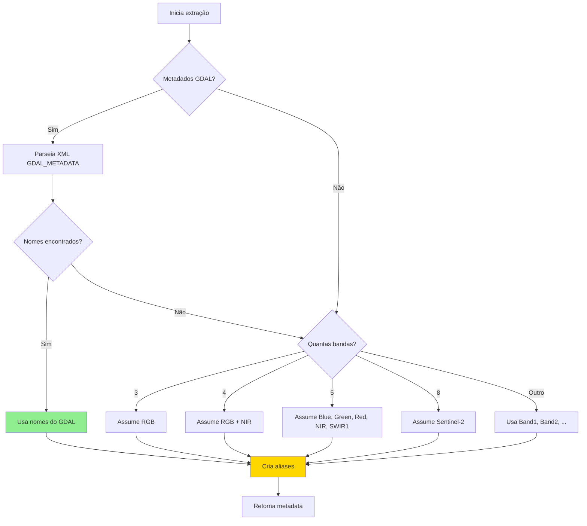

**Exemplo de aliases:**
```typescript
// Banda "NIR" pode ser acessada como:
- "nir"
- "near_infrared"
- "b4" (se for a 4ª banda)
- "band4"
```

---

### 3️⃣ **ExpressionParser**
```typescript
// Responsável por: interpretar e executar equações matemáticas
```

**Algoritmo (Shunting Yard + RPN):**

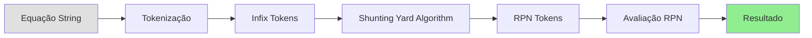

**Exemplo passo-a-passo:**

```
Entrada: "(nir - red) / (nir + red)"

1️⃣ TOKENIZAÇÃO:
['(', 'nir', '-', 'red', ')', '/', '(', 'nir', '+', 'red', ')']

2️⃣ CONVERSÃO PARA RPN (Notação Polonesa Reversa):
['nir', 'red', '-', 'nir', 'red', '+', '/']

3️⃣ AVALIAÇÃO (para NIR=0.8, RED=0.2):
Stack: []
- Push 0.8           → [0.8]
- Push 0.2           → [0.8, 0.2]
- Op '-'             → [0.6]
- Push 0.8           → [0.6, 0.8]
- Push 0.2           → [0.6, 0.8, 0.2]
- Op '+'             → [0.6, 1.0]
- Op '/'             → [0.6]

Resultado: 0.6 (NDVI)
```

**Operações suportadas:**
- Operadores: `+`, `-`, `*`, `/`, `^`
- Funções: `sqrt`, `abs`, `log`, `log10`, `exp`, `sin`, `cos`, `tan`, `min`, `max`

---

### 4️⃣ **TileService**
```typescript
// Responsável por: orquestração do processamento de tiles
```

**Pipeline de processamento:**

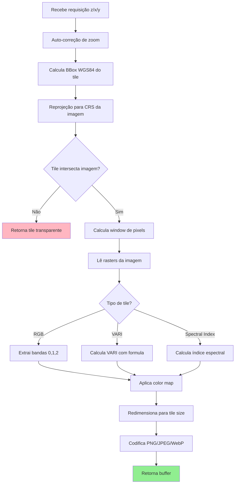

---

### 5️⃣ **ColorMap**
```typescript
// Responsável por: aplicar paletas de cores aos valores calculados
```

**Paletas disponíveis:**

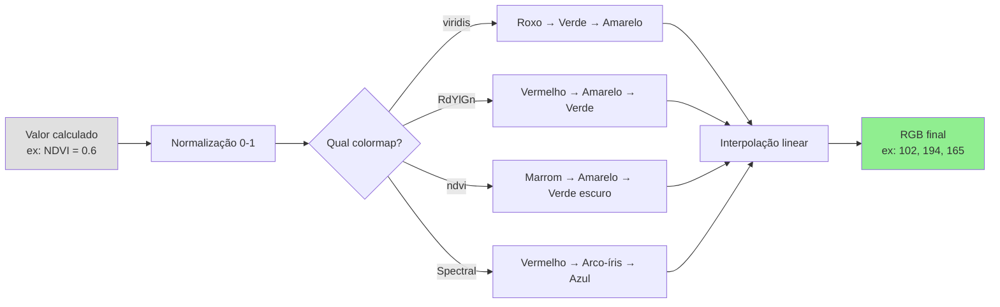

**Exemplo de interpolação:**

```
ColorMap RdYlGn = [
  [165, 0, 38],      // Vermelho (0.0)
  [254, 224, 139],   // Amarelo (0.5)
  [0, 104, 55]       // Verde (1.0)
]

Valor: 0.6 (normalizado)
↓
Interpola entre Amarelo (0.5) e Verde (1.0)
Factor = (0.6 - 0.5) / (1.0 - 0.5) = 0.2
↓
R = 254 + (0 - 254) * 0.2 = 203
G = 224 + (104 - 224) * 0.2 = 200
B = 139 + (55 - 139) * 0.2 = 122
↓
RGB(203, 200, 122)
```

---

## 📊 Diagramas Arquiteturais

### Arquitetura em Camadas

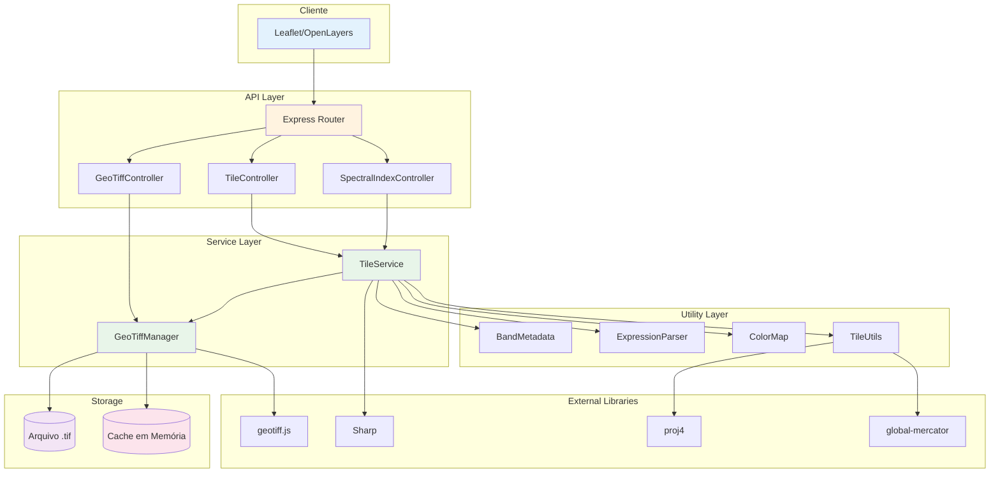

---

### Fluxo de Dados - Tile de Índice Espectral

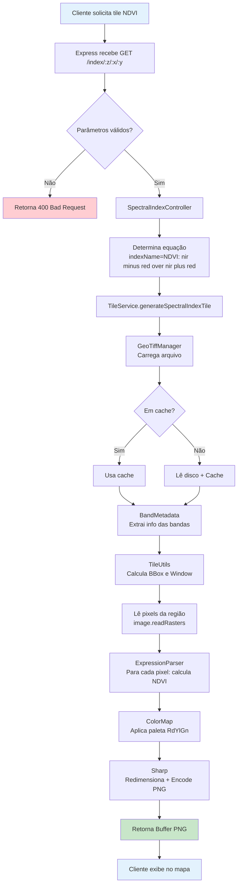

---

### Processamento Pixel-por-Pixel

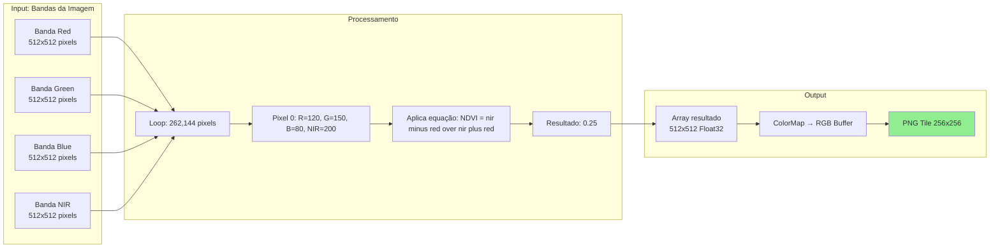

---

## 🔧 Configurações e Otimizações

### Cache Strategy

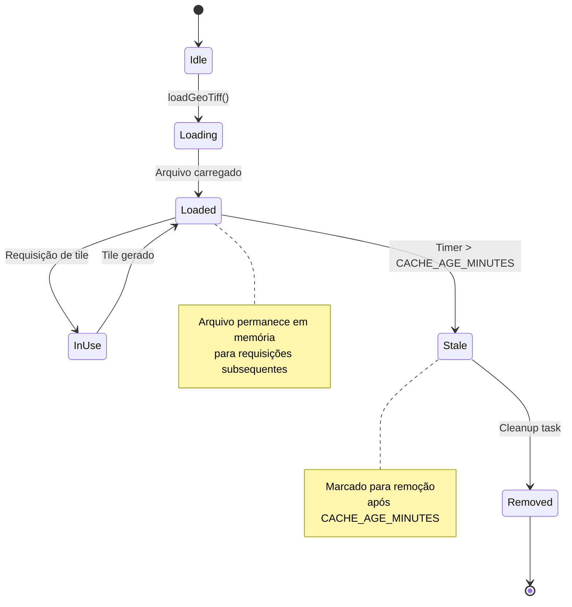

---

### Reprojeção de Coordenadas

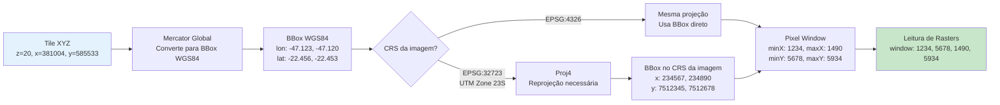

---

## 📈 Performance

### Métricas Típicas

| Operação | Tempo Médio | Cache Hit | Cache Miss |
|----------|-------------|-----------|------------|
| Tile RGB 256x256 | ~50ms | ~30ms | ~200ms |
| Tile NDVI 256x256 | ~80ms | ~60ms | ~250ms |
| Parse de equação | ~1ms | - | - |
| ColorMap application | ~5ms | - | - |
| Sharp PNG encode | ~15ms | - | - |

### Otimizações Implementadas

1. **Cache em memória** - Evita releitura de disco
2. **Singleton pattern** - GeoTiffManager único
3. **Lazy loading** - Só carrega quando necessário
4. **Cleanup automático** - Remove arquivos antigos
5. **Float32Array** - Operações matemáticas rápidas
6. **Sharp** - Biblioteca C++ nativa para imagens

---

## 🎓 Conceitos Chave

### Sistema de Tiles XYZ

```
Zoom 0: 1 tile (mundo inteiro)
Zoom 1: 4 tiles (2x2)
Zoom 2: 16 tiles (4x4)
...
Zoom 20: 1,099,511,627,776 tiles (2^20 x 2^20)

Cada tile: 256x256 pixels (padrão)
```

### Índices Espectrais

**NDVI (Normalized Difference Vegetation Index)**
```
NDVI = (NIR - Red) / (NIR + Red)
Valores: -1 a 1
- Valores altos (0.6-1.0): Vegetação saudável
- Valores médios (0.2-0.6): Vegetação moderada
- Valores baixos (<0.2): Solo, água, áreas urbanas
```

**NDWI (Normalized Difference Water Index)**
```
NDWI = (Green - NIR) / (Green + NIR)
Útil para detectar corpos d'água
```

### Bandas Espectrais

| Banda | Comprimento de Onda | Aplicação |
|-------|---------------------|-----------|
| Blue | 450-495 nm | Penetração na água |
| Green | 495-570 nm | Pico de reflectância vegetal |
| Red | 620-750 nm | Absorção de clorofila |
| NIR | 750-900 nm | Estrutura celular das plantas |
| SWIR1 | 1550-1750 nm | Umidade do solo/vegetação |
| SWIR2 | 2080-2350 nm | Minerais, rochas |

---

## 🔗 Integrações

### Leaflet.js

```javascript
const tileLayer = L.tileLayer(
  'http://localhost:3001/index/{z}/{x}/{y}?indexName=NDVI&colormap=RdYlGn',
  {
    attribution: 'GeoTIFF Tile Server',
    maxZoom: 22
  }
);
```

### OpenLayers

```javascript
const tileLayer = new ol.layer.Tile({
  source: new ol.source.XYZ({
    url: 'http://localhost:3001/index/{z}/{x}/{y}?indexName=NDVI&colormap=RdYlGn'
  })
});
```

---

## 📚 Referências

- [GeoTIFF.js Documentation](https://geotiffjs.github.io/)
- [Sharp Image Processing](https://sharp.pixelplumbing.com/)
- [Proj4 Projections](https://proj.org/)
- [Slippy Map Tile Names (OSM)](https://wiki.openstreetmap.org/wiki/Slippy_map_tilenames)
- [Spectral Indices Handbook](https://www.indexdatabase.de/)

