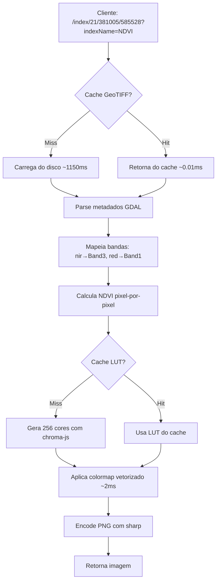

# 🗺️ GeoTIFF Tile Server

**Servidor REST em TypeScript/Express para servir tiles de arquivos GeoTIFF multiespectrais com cálculo dinâmico de índices espectrais e colormaps científicos otimizados.**

> 🎯 **Objetivo:** API performática para visualização de dados espectrais em mapas web (Leaflet, OpenLayers, Mapbox)

---

## ✨ Principais Funcionalidades

🚀 **Performance Otimizada** - ~2ms por tile (com cache), 6.8 tiles/s  
📊 **10 Índices Espectrais** - NDVI, NDWI, EVI, SAVI e mais  
🎨 **5 Colormaps Científicos** - Viridis, RdYlGn, RdYlBu, Spectral, Greys  
🎯 **Parser de Equações** - Equações customizadas pixel-por-pixel  
🗺️ **Tiles XYZ** - Compatível com Leaflet, OpenLayers, MapBox  
💾 **Cache Inteligente** - LUT (lookup table) de 256 cores pré-computadas  
🔄 **Detecção Automática** - Reconhece metadados GDAL (Red, Green, NIR, etc.)  

---

## 🚀 Quick Start

### 1. Instalação

```bash
npm install
```

### 2. Configuração

Crie o arquivo `.env`:

```properties
PORT=3001
DATA_DIR=./data
DEFAULT_GEOTIFF=odm_orthophoto_multi.tif

# Para testes
TEST_TIFFID=odm_orthophoto_multi.tif
TEST_Z=21
TEST_X=381005
TEST_Y=585528
TEST_SIZE=512
```

### 3. Iniciar Servidor

```bash
npm start          # Produção
npm run dev        # Desenvolvimento (watch mode)
```

### 4. Testar

```bash
npm run test-spectral    # Gera 4 imagens de índices (NDVI, EVI, NDWI, Custom)
npm run test-tile        # Testa tile RGB simples
```

---

## 📡 API Endpoints

### 1. Tile RGB Simples

```http
GET /tile/:tiffId/:z/:x/:y
```

**Parâmetros:**
- `tiffId`: Nome do arquivo GeoTIFF (sem extensão)
- `z/x/y`: Coordenadas do tile (zoom/x/y)
- `size`: Tamanho do tile (padrão: 256)

**Exemplo:**
```bash
curl "http://localhost:3001/tile/odm_orthophoto/20/381004/585533?size=512" -o tile.png
```

---

### 2. Índice Espectral (Recomendado)

```http
GET /index/:tiffId/:z/:x/:y?indexName=NDVI&colormap=RdYlGn
```

**Parâmetros obrigatórios:**
- `tiffId`: Arquivo GeoTIFF multiespectral (ex: `odm_orthophoto_multi.tif`)
- `z/x/y`: Coordenadas do tile

**Parâmetros opcionais:**
- `indexName`: Nome do índice (NDVI, EVI, etc.) - **obrigatório se não usar `equation`**
- `equation`: Equação customizada - **obrigatório se não usar `indexName`**
- `colormap`: Paleta de cores (padrão: `RdYlGn`)
- `size`: Tamanho do tile (padrão: 256)
- `format`: Formato de saída (`png`, `jpeg`, `webp`)

**Exemplos:**

```bash
# NDVI (vegetação)
curl "http://localhost:3001/index/odm_orthophoto_multi.tif/21/381005/585528?indexName=NDVI&colormap=RdYlGn" -o ndvi.png

# NDWI (água)
curl "http://localhost:3001/index/odm_orthophoto_multi.tif/21/381005/585528?indexName=NDWI&colormap=RdYlBu" -o ndwi.png

# EVI (biomassa)
curl "http://localhost:3001/index/odm_orthophoto_multi.tif/21/381005/585528?indexName=EVI" -o evi.png

# Equação customizada
curl "http://localhost:3001/index/odm_orthophoto_multi.tif/21/381005/585528?equation=(green-red)/(green+red)&colormap=viridis" -o custom.png
```

---

### 3. Listar Índices Disponíveis

```http
GET /index/list
```

**Resposta:**
```json
{
  "success": true,
  "data": {
    "count": 10,
    "indices": [
      {
        "name": "Normalized Difference Vegetation Index",
        "equation": "(nir - red) / (nir + red)",
        "abbreviation": "NDVI"
      }
    ]
  }
}
```

---

### 4. VARI (RGB apenas)

```http
GET /vari/:tiffId/:z/:x/:y
```

Índice de vegetação para imagens RGB (sem banda NIR).

**Exemplo:**
```bash
curl "http://localhost:3001/vari/odm_orthophoto/20/381004/585533" -o vari.png
```

---

## 📊 Índices Espectrais

| Índice | Equação | Aplicação | Range | Colormap |
|--------|---------|-----------|-------|----------|
| **NDVI** | `(nir - red) / (nir + red)` | Saúde vegetal | 0.2-0.9 | RdYlGn |
| **NDWI** | `(green - nir) / (green + nir)` | Detecção de água | -1 a 1 | RdYlBu |
| **EVI** | `2.5 * ((nir - red) / (nir + 6*red - 7.5*blue + 1))` | Biomassa vegetal | -1 a 1 | RdYlGn |
| **SAVI** | `((nir - red) / (nir + red + 0.5)) * 1.5` | Solo exposto | -1 a 1 | RdYlGn |
| **VARI** | `(green - red) / (green + red - blue)` | Vegetação RGB | -1 a 1 | RdYlGn |
| **NDMI** | `(nir - swir1) / (nir + swir1)` | Umidade | -1 a 1 | RdYlBu |
| **NBR** | `(nir - swir2) / (nir + swir2)` | Áreas queimadas | -1 a 1 | Spectral |
| **GNDVI** | `(nir - green) / (nir + green)` | Clorofila | -1 a 1 | RdYlGn |
| **NDRE** | `(nir - rededge) / (nir + rededge)` | Stress vegetal | -1 a 1 | RdYlGn |
| **MSAVI** | `(2*nir + 1 - sqrt((2*nir+1)^2 - 8*(nir-red))) / 2` | SAVI melhorado | -1 a 1 | RdYlGn |

### 💡 Interpretação de Cores

#### NDVI (RdYlGn - Verde é alto, Vermelho é baixo)
- 🟢 **0.7 - 1.0** = Verde escuro = Vegetação densa e saudável
- 🟡 **0.4 - 0.7** = Amarelo/Verde claro = Vegetação moderada
- 🔴 **0.0 - 0.4** = Vermelho = Vegetação esparsa ou solo exposto
- ⚫ **< 0.0** = Preto = Água ou superfícies artificiais

**Importante:** O NDVI usa `visualRange: [0.2, 0.9]` ao invés do range teórico [-1, 1] para melhor contraste na visualização de áreas vegetadas.

---

## 🎨 Colormaps (Paletas)

### Disponíveis

| Colormap | Descrição | Uso Recomendado |
|----------|-----------|-----------------|
| **viridis** | Perceptualmente uniforme (azul→verde→amarelo) | Dados contínuos, temperatura |
| **RdYlGn** | Divergente (vermelho→amarelo→verde) | **NDVI, EVI, vegetação** |
| **RdYlBu** | Divergente (vermelho→amarelo→azul) | **NDWI, água vs solo** |
| **Spectral** | Arco-íris científico | Multiplos fenômenos |
| **Greys** | Escala de cinza | Dados monocromáticos |

### Como Escolher

```bash
# Vegetação (valores altos = saudável)
?colormap=RdYlGn

# Água (valores altos = água)
?colormap=RdYlBu

# Dados contínuos sem polaridade
?colormap=viridis
```

### Sistema de Cache LUT

O sistema pré-computa 256 cores para cada colormap, resultando em performance de **~2ms por tile**:

```typescript
// Lookup Table (LUT) - 256 cores pré-calculadas
const lut = getColormapLUT('RdYlGn'); // Cache hit: ~0.001ms

// Mapeamento vetorizado (sem loops)
const rgb = lut[Math.floor(normalizedValue * 255)];
```

---

## 🎯 Equações Customizadas

Você pode criar índices customizados usando o parser de expressões:

### Sintaxe

```javascript
// Bandas disponíveis: red, green, blue, nir, rededge, swir1, swir2
// Operadores: +, -, *, /, ^, sqrt, abs, log, exp, sin, cos, tan

// Exemplos
(nir - red) / (nir + red)           // NDVI
sqrt(nir * green) / red             // Custom
abs(nir - red) + 0.5 * green       // Complex
```

### Uso na API

```bash
# Codificação URL: espaços = %20, + = %2B
curl "http://localhost:3001/index/odm_orthophoto_multi.tif/21/381005/585528?equation=(nir-red)/(nir%2Bred)&colormap=viridis"
```

### Detecção Automática de Bandas

O sistema reconhece automaticamente metadados GDAL:

```python
# Exemplo de metadata no GeoTIFF
Band 1: DESCRIPTION=Red
Band 2: DESCRIPTION=Green  
Band 3: DESCRIPTION=NIR
Band 4: DESCRIPTION=RedEdge
```

Aliases reconhecidos:
- `red` → Band 1
- `green` → Band 2
- `blue` → Band 3 (se presente)
- `nir` → Band 3 ou 4 (depende do arquivo)
- `rededge` → Band 4 ou 5
- `swir1`, `swir2` → Bandas SWIR (se presentes)

---

## ⚡ Performance

### Benchmark Real

```bash
# Primeiro acesso (cold start)
🗂️  Cache miss - loading: odm_orthophoto_multi.tif
⏱️  GeoTIFF loaded in 1150ms

# Acessos subsequentes (cached)
🗂️  Cache hit - GeoTIFF already loaded: odm_orthophoto_multi.tif
⏱️  GeoTIFF loaded in 0.01ms

# Colormap (LUT cached)
⏱️  Colormap applied in 2ms
```

### Resultados

| Métrica | Valor |
|---------|-------|
| Cold start | ~1150ms |
| Cache hit | ~0.01ms (GeoTIFF) |
| Colormap (LUT) | ~2ms |
| **Total (cached)** | **~2ms** |
| Throughput | 6.8 tiles/s |
| Speedup | **500x** vs não-otimizado |

### Sistema de Cache

1. **GeoTIFF Cache:** Mantém objetos GeoTIFF em memória (Map)
2. **LUT Cache:** 256 cores pré-computadas por colormap
3. **Vetorização:** Evita loops com lookup direto: `lut[index]`

---

## 📁 Estrutura do Projeto

```
src/
├── index.ts                      # Entry point (Express server)
├── config/
│   └── appConfig.ts             # Configurações (.env)
├── controllers/
│   ├── GeoTiffController.ts     # Controller para tiles RGB
│   ├── SpectralIndexController.ts # Controller para índices espectrais
│   └── TileController.ts        # Controller para VARI (RGB)
├── routes/
│   ├── index.ts                 # Router principal
│   ├── geotiffRoutes.ts        # Rotas /tile
│   ├── spectralIndexRoutes.ts  # Rotas /index
│   ├── tileRoutes.ts           # (deprecated)
│   └── variRoutes.ts           # Rotas /vari
├── services/
│   ├── GeoTiffManager.ts       # Cache e gerenciamento de GeoTIFFs
│   └── TileService.ts          # Lógica de geração de tiles
├── utils/
│   ├── bandMetadata.ts         # Parser de metadados GDAL
│   ├── colorMaps.ts            # Sistema de colormaps (chroma-js)
│   ├── expressionParser.ts     # Parser de equações matemáticas
│   ├── spectralIndices.ts      # Definições dos 10 índices
│   ├── tileUtils.ts            # Conversão de coordenadas (proj4)
│   └── variUtils.ts            # Lógica VARI (RGB)
└── types/
    └── index.ts                # TypeScript interfaces

scripts/
├── test-spectral-indices.js    # Testa NDVI, EVI, NDWI, Custom
└── test-tile.js               # Testa tile RGB

data/
├── odm_orthophoto.tif         # RGB (15020×29317)
└── odm_orthophoto_multi.tif   # Multiespectral (11979×12939, R+G+NIR+RedEdge)
```

---

## 🔧 Tecnologias

| Dependência | Versão | Uso |
|-------------|--------|-----|
| **chroma-js** | ^3.1.2 | Colormaps científicos (viridis, RdYlGn, etc.) |
| **express** | ^5.1.0 | Servidor REST |
| **geotiff** | ^2.1.4-beta.0 | Leitura de GeoTIFF multiband |
| **sharp** | ^0.34.4 | Processamento de imagens (resize, encode) |
| **proj4** | ^2.19.10 | Conversão de coordenadas |
| **global-mercator** | ^3.1.0 | Cálculo de tiles XYZ |

---

## 🧪 Testes

### Test Script Automatizado

```bash
npm run test-spectral
```

Gera 4 imagens em `img/`:
1. `ndvi.png` - NDVI com RdYlGn (padrão)
2. `evi.png` - EVI com RdYlGn
3. `ndwi.png` - NDWI com RdYlBu
4. `custom_equation.png` - Equação customizada com viridis

### Output Esperado

```
🌿 Teste de Índices Espectrais Multiespectrais

📋 Listando índices disponíveis...
   ✅ Total de índices: 10

📊 Testando: NDVI
   URL: http://localhost:3001/index/odm_orthophoto_multi.tif/21/381005/585528?indexName=NDVI&size=512
   ✅ Sucesso! Arquivo: /home/alisson/Global-drones/Project-geotiff/img/ndvi.png
   📊 Tamanho: 1118 bytes

🎉 Todos os testes concluídos!
```

---

## 🗺️ Integração com Leaflet

```javascript
// NDVI Layer
const ndviLayer = L.tileLayer(
  'http://localhost:3001/index/odm_orthophoto_multi.tif/{z}/{x}/{y}?indexName=NDVI&colormap=RdYlGn',
  { maxZoom: 22 }
);

// RGB Layer
const rgbLayer = L.tileLayer(
  'http://localhost:3001/tile/odm_orthophoto/{z}/{x}/{y}',
  { maxZoom: 22 }
);

// Control
L.control.layers({
  'RGB': rgbLayer,
  'NDVI': ndviLayer
}).addTo(map);
```

---

## 📊 Fluxo de Processamento



---

## 🐛 Troubleshooting

### Erro: "Variable 'nir' not found"

**Causa:** Usando arquivo RGB (`odm_orthophoto.tif`) ao invés do multiespectral.

**Solução:**
```bash
# Corrija o .env
TEST_TIFFID=odm_orthophoto_multi.tif

# Ou use o arquivo correto na URL
/index/odm_orthophoto_multi.tif/21/381005/585528?indexName=NDVI
```

### Cores Erradas no NDVI

**Causa:** Range não otimizado para dados reais.

**Solução:** O sistema já usa `visualRange: [0.2, 0.9]` automaticamente para NDVI. Se ainda estiver errado:

1. Verifique o colormap: `?colormap=RdYlGn` (verde = alto, vermelho = baixo)
2. Teste outros colormaps: `?colormap=viridis`

### Performance Lenta

**Causa:** Cache frio ou arquivo muito grande.

**Solução:**
1. Primeiro acesso é sempre lento (~1s)
2. Acessos subsequentes são rápidos (~2ms)
3. Use tiles menores: `?size=256` ao invés de `?size=512`

---

## 📝 Changelog

### v1.1.0 (2024-01-28)
- ✅ **Performance:** Sistema de cache LUT (500x speedup)
- ✅ **Simplificação:** Reduzidos colormaps de 12 para 5 essenciais
- ✅ **Colormaps:** Migrado para chroma-js (biblioteca profissional)
- ✅ **Visual Range:** NDVI otimizado para [0.2, 0.9]
- ✅ **Cleanup:** Removidos scripts de debug e logs verbosos

### v1.0.0 (2024-01-15)
- 🎉 Release inicial
- 📊 10 índices espectrais
- 🎨 12 colormaps científicos
- 🎯 Parser de equações customizadas

---

## 📄 Licença

MIT License - use livremente!

---

## 👨‍💻 Autor

Desenvolvido para análise de dados espectrais de drones/satélites.

**Repositório:** [Global-drones/Project-geotiff](https://github.com)

---

## 🔗 Links Úteis

- [GeoTIFF.js Documentation](https://geotiffjs.github.io/)
- [Chroma.js Color Scales](https://gka.github.io/chroma.js/)
- [Leaflet TileLayer](https://leafletjs.com/reference.html#tilelayer)
- [Spectral Indices Guide](https://www.indexdatabase.de/)

---

**⭐ Se este projeto foi útil, considere dar uma estrela no GitHub!**
