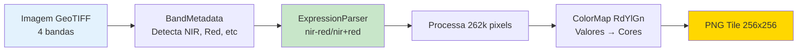

# 🗺️ GeoTIFF Tile Server - Guia Rápido

**Servidor REST em TypeScript/Express para servir tiles de arquivos GeoTIFF multiespectrais com cálculo dinâmico de índices espectrais.**

> 🎯 **Objetivo:** Replicar funcionalidades do `rio-tiler` (Python) em TypeScript/Node.js

---

## ✨ Principais Funcionalidades


🎯 **Parser de Equações Matemáticas** - Interprete equações como strings e aplique-as pixel-por-pixel  
🎨 **12 Color Maps** - Paletas científicas para visualização de dados  
📊 **Índices Espectrais Pré-definidos** - NDVI, NDWI, EVI, SAVI, VARI e mais  
🗺️ **Sistema de Tiles XYZ** - Compatível com Leaflet, OpenLayers, MapBox  
🔄 **Reprojeção Automática** - Suporte a múltiplos sistemas de coordenadas (EPSG)  
💾 **Cache Inteligente** - Gerenciamento automático de memória  
🎭 **Detecção de Bandas** - Reconhecimento automático de metadados GDAL  

---

## 🚀 Quick Start

### Instalação e Setup
```bash
npm install
cp .env.example .env
npm run dev
```

### Endpoints Principais
```bash
# 1. Tile RGB simples
GET /tile/:z/:x/:y

# 2. Índice Espectral (Recomendado)
GET /index/:z/:x/:y?indexName=NDVI&colormap=RdYlGn

# 3. Equação Customizada
GET /index/:z/:x/:y?equation=(nir-red)/(nir+red)&colormap=viridis
```

### Exemplo Prático
```bash
# NDVI para agricultura
curl "http://localhost:3001/index/20/381004/585533?indexName=NDVI&colormap=RdYlGn"

# Equação personalizada
curl "http://localhost:3001/index/20/381004/585533?equation=sqrt(nir*green)/red&colormap=plasma"
```

---

## 🎨 Índices Disponíveis

| Índice | Equação | Aplicação |
|--------|---------|-----------|
| NDVI | `(nir - red) / (nir + red)` | Saúde vegetal |
| NDWI | `(green - nir) / (green + nir)` | Detecção de água |
| EVI | `2.5 * ((nir - red) / (nir + 6*red - 7.5*blue + 1))` | Biomassa vegetal |
| SAVI | `((nir - red) / (nir + red + 0.5)) * 1.5` | Solo exposto |
| VARI | `(green - red) / (green + red - blue)` | Vegetação (RGB only) |
| NDMI | `(nir - swir1) / (nir + swir1)` | Umidade |
| NBR | `(nir - swir2) / (nir + swir2)` | Áreas queimadas |
| GNDVI | `(nir - green) / (nir + green)` | Clorofila |
| NDRE | `(nir - rededge) / (nir + rededge)` | Stress vegetal |
| MSAVI | `(2*nir + 1 - sqrt((2*nir+1)^2 - 8*(nir-red))) / 2` | SAVI melhorado |

---

## 🎨 Color Maps

```bash
# Científicos
viridis, plasma, inferno, magma, cividis

# Divergentes (melhor para índices -1 a 1)
RdYlGn, RdYlBu, Spectral

# Especializados
ndvi     # Otimizado para vegetação
terrain  # Topografia
Greys    # Escala de cinza
```

---

## 📊 Como Funciona

### Fluxo Simplificado

```
1. Cliente solicita: /index/20/381004/585533?indexName=NDVI
                                                    ↓
2. Sistema carrega GeoTIFF (com cache)
                                                    ↓
3. Detecta bandas automaticamente:
   ['Red', 'Green', 'Blue', 'NIR']
   Aliases: nir→banda3, red→banda0
                                                    ↓
4. Mapeia NDVI → equação: "(nir - red) / (nir + red)"
                                                    ↓
5. Calcula BBox do tile (z/x/y → coordenadas geográficas)
                                                    ↓
6. Lê pixels da região (window reading)
                                                    ↓
7. Para cada pixel (ex: 262,144 pixels em 512x512):
   - Lê NIR=200, RED=50
   - Calcula: (200-50)/(200+50) = 0.6
                                                    ↓
8. Aplica color map RdYlGn:
   - 0.6 → RGB(102, 194, 165) [Verde]
                                                    ↓
9. Redimensiona para 256x256 e codifica PNG
                                                    ↓
10. Retorna tile PNG para cliente
```

### Exemplo Visual



---

## 🧩 Componentes Principais

### 1. GeoTiffManager
- Cache singleton em memória
- Carregamento lazy (só quando necessário)
- Cleanup automático (CACHE_AGE_MINUTES)

### 2. BandMetadata
- Lê metadados GDAL do GeoTIFF
- Detecta automaticamente padrões (RGB, RGBN, Sentinel-2)
- Cria aliases: `nir`, `near_infrared`, `b4`, `band4`

### 3. ExpressionParser
- Tokenização da equação
- Algoritmo Shunting Yard (Infix → RPN)
- Avaliação pixel-por-pixel
- Suporta: `+`, `-`, `*`, `/`, `^`, `sqrt`, `abs`, `log`, etc.

### 4. TileService
- Orquestra todo o processamento
- Reprojeção automática (WGS84 ↔ qualquer EPSG)
- Auto-correção de zoom
- Geração de tiles transparentes quando fora de área

### 5. ColorMap
- 12 paletas científicas
- Interpolação linear entre cores
- Suporte a percentis (ignora outliers)

---

## 📁 Estrutura do Projeto

```
src/
├── index.ts                      # Bootstrap do servidor
├── controllers/                  # Camada de apresentação
│   ├── GeoTiffController.ts     # Gerenciamento de arquivos
│   ├── TileController.ts        # Tiles RGB
│   └── SpectralIndexController.ts # Índices espectrais
├── routes/                       # Rotas REST
│   ├── index.ts                 # Agregador de rotas
│   ├── geotiffRoutes.ts         
│   ├── tileRoutes.ts            
│   ├── variRoutes.ts            
│   └── spectralIndexRoutes.ts   
├── services/                     # Lógica de negócio
│   ├── GeoTiffManager.ts        # 🔥 Cache singleton + carregamento
│   └── TileService.ts           # 🔥 Geração e processamento de tiles
├── utils/                        # Utilitários
│   ├── bandMetadata.ts          # 🎯 Detecção automática de bandas
│   ├── expressionParser.ts      # 🧮 Parser de equações matemáticas
│   ├── spectralIndices.ts       # 📊 Definições de índices
│   ├── colorMaps.ts             # 🎨 Paletas de cores
│   └── tileUtils.ts             # 🗺️ Conversão de coordenadas
├── types/
│   └── index.ts                 # Tipos TypeScript
└── config/
    └── appConfig.ts             # Configurações

tests/
└── core.test.ts                 # Testes de integração

data/
└── odm_orthophoto.tif           # GeoTIFF de exemplo
```

---

## 💡 Casos de Uso

### Agricultura de Precisão
```bash
# Saúde da vegetação
GET /index/{z}/{x}/{y}?indexName=NDVI&colormap=RdYlGn

# Estresse hídrico
GET /index/{z}/{x}/{y}?indexName=NDMI&colormap=RdYlBu
```

### Monitoramento Ambiental
```bash
# Detecção de água
GET /index/{z}/{x}/{y}?indexName=NDWI&colormap=RdYlBu

# Áreas queimadas
GET /index/{z}/{x}/{y}?indexName=NBR&colormap=Spectral
```

### Pesquisa Customizada
```bash
# Experimento personalizado
GET /index/{z}/{x}/{y}?equation=sqrt(nir*green)/red&colormap=viridis
```


---

## 📈 Performance

| Operação | Tempo |
|----------|-------|
| Tile RGB 256x256 (cache hit) | ~30ms |
| Tile NDVI 256x256 (cache hit) | ~60ms |
| Tile NDVI 256x256 (cache miss) | ~250ms |
| Parse equação | ~1ms |
| ColorMap application | ~5ms |

---

## 📚 Documentação Completa

- **[README.md](./README.md)** - Documentação completa da API
- **[ARQUITETURA.md](./Architecture.md)** - Diagramas técnicos detalhados

---

## 🎯 Stack Tecnológico

### Linguagens e Runtime
- **TypeScript** (ES2022, modo strict)
- **Node.js** (ES modules, "type": "module")

### Principais Frameworks e Libs
- **express** (v5.1.0): Servidor HTTP e roteamento
- **geotiff** (v2.1.4): Leitura e acesso a rasters em arquivos GeoTIFF
- **sharp** (v0.34.4): Processamento e codificação de imagens (PNG/JPEG/WebP)
- **global-mercator** (v3.1.0): Conversão de tiles (Z/X/Y) para bounding boxes WGS84
- **proj4** (v2.19.10): Reprojeção de coordenadas entre sistemas (EPSG)

### Testes
- **jest** + **ts-jest**: Testes unitários e de integração
- **supertest**: Testes de endpoints HTTP

### Ferramentas de Desenvolvimento
- **tsx**: Execução de TypeScript sem build prévio
- **typescript** (v5.9.3)

